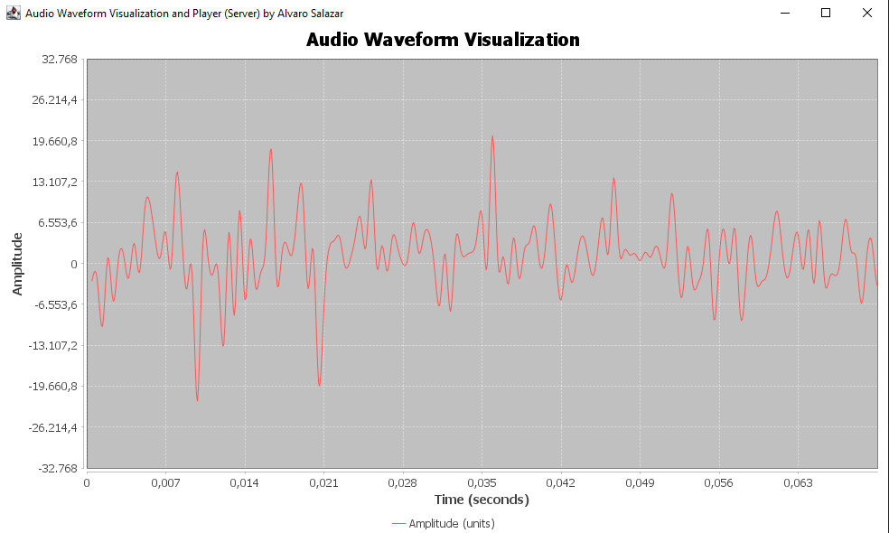

# AudioServerWithGraph

**AudioServerWithGraph** is a Java application that functions as a TCP server for real-time audio streaming. It receives audio data from clients, plays it back, and dynamically visualizes the waveform on a graphical user interface. 

The application supports various visualization styles, allowing users to choose between displaying the average, average and current values, or unique values.

It uses TCP sockets to receive audio data from clients and the Java Sound API to play back the audio. It only works with PCM audio formats (RIFF) @ 44100 Hz, 16-bit, stereo, little-endian, mono. It needs a good and fast network connection to work properly.

It also has the ability to act as a client, allowing it to connect to other servers and send audio data.

## Features

- **Real-time Audio Streaming:** Acts as a server for receiving and playing back audio data in real-time.
- **Waveform Visualization:** Displays the audio waveform dynamically with different visualization styles.
- **Customizable Parameters:** Users can customize parameters such as duration and width for the waveform visualization.
- **Graphical User Interface:** Provides an easy-to-use GUI for monitoring and controlling audio streaming.
- **Support digital audio formats:** Supports PCM audio formats (RIFF) @ 44100 Hz, 16-bit, little-endian, mono.
- **Client Mode:** The server can also act as a client, allowing it to connect to other servers and send audio data.

## Dependencies

- [JFreeChart Library](https://sourceforge.net/projects/jfreechart/): Used for graphical charting and visualization.
- [Java Sound API](https://docs.oracle.com/javase/tutorial/sound/index.html): Used for audio playback.

## UI Screenshot




## Usage

- Run the following command to build the project:
```shell
./gradlew
```
- Execute the server application using the following command:

```shell
./gradlew run
```
- Connect clients that send audio data to the server's IP address and port (default port: 12345).
- The server will play back the audio and display the waveform visualization on the GUI.

## Getting Started

Ensure that the JFreeChart library is included in the project's classpath. You can find the library [here](https://sourceforge.net/projects/jfreechart/).

## Building the JAR

To build a standalone JAR file, run the following command:
    
```shell
./gradlew jar
```
The JAR file will be located in the `build/libs/` directory.

## Running the JAR

### Server
To run the application as a server with default port (port 12345), execute the following command:
```shell
java -jar build/libs/digitalaudioserver-1.0-SNAPSHOT-all.jar
```

To run the application as a server with a specific port, execute the following command:
```shell
java -jar .\build\libs\digitalaudioserver-1.0-SNAPSHOT-all.jar server 12345
```

### Client
To run the application as a client streaming a 440Hz sine wave (10 seconds), execute the following command:
```shell
java -jar .\build\libs\digitalaudioserver-1.0-SNAPSHOT-all.jar client
```

To run the application as a client streaming a WAV file to a server running on the local machine, execute the following command: 
```shell
java -jar .\build\libs\digitalaudioserver-1.0-SNAPSHOT-all.jar client localhost 12345 musica.wav
```

To run the application as a client streaming a WAV file, specify the host IP address, port, and file name as arguments. For example, to stream a WAV file to the server at
```shell
java -jar .\build\libs\digitalaudioserver-1.0-SNAPSHOT-all.jar client 127.0.0.1 12345 musica.wav
```

## License

This project is licensed under the MIT License - see the [LICENSE](LICENSE) file for details.

## Author

Alvaro Salazar <alvaro@denkitronik.com>

## Acknowledgments

### Libraries
- Special thanks to the contributors of the JFreeChart library.
- Thanks to the authors of the Java Sound API documentation.

### Audio Files
- **Sample Song:** We would like to express our gratitude to Kevin MacLeod (incompetech.com) for providing the sample song used in this project.

    - **Title:** Furious Freak
    - **Artist:** Kevin MacLeod
    - **License:** Licensed under Creative Commons: By Attribution 3.0
    - **License Link:** [Creative Commons: By Attribution 3.0](http://creativecommons.org/licenses/by/3.0/)
    - **Song File Link:** [Furious Freak WAV](musica.wav)
    

## References

- [JFreeChart Library](https://sourceforge.net/projects/jfreechart/)
- [JFreeChart Developer Guide](https://www.jfree.org/jfreechart/api/guide.html)
- [JFreeChart API Reference](https://www.jfree.org/jfreechart/api/javadoc/index.html)
- [Java Sound API](https://docs.oracle.com/javase/tutorial/sound/index.html)
- [Java Sound API: Programmer's Guide](https://docs.oracle.com/javase/tutorial/sound/TOC.html)
- [Java Sound API: Reference](https://docs.oracle.com/javase/8/docs/api/javax/sound/sampled/package-summary.html)
